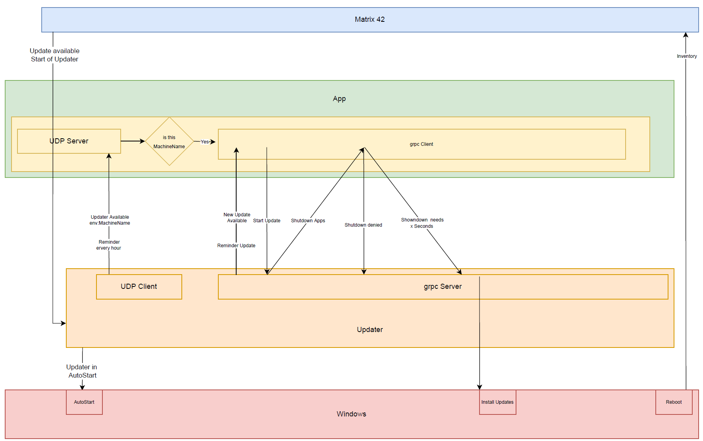

# Updater (Proof of concept)

## Overview



## Run with 3 TestApps


## Integration in TestApp

```csharp
   using var updaterClient = new UpdaterClient(name)
            .OnUpdaterAvailable((machineName) =>
            {
                AnsiConsole.WriteLine($"Updater available on machine {machineName}, {DateTime.Now}");
            })
            .OnUpdateAvailable(async (client) =>
            {
                if (AnsiConsole.Confirm("Start Update?"))
                    await client.UpdateStartAsync();
            })
            .OnConfirmUpdate(async (client) =>
            {
                await client.UpdateAllowedAsync(
                    AnsiConsole.Confirm("Confirm Update?"), TimeSpan.FromSeconds(5));
            })
            .OnInventory(async (client) =>
            {
                await client.InventoryAsync(new List<Updater.CoreLib.grpc.InventoryPacket>
                {
                    new Updater.CoreLib.grpc.InventoryPacket { 
                        Path=$"{name}.a.b.c", Type= "Plc", 
                        Version="Plc.1234", Serialnumber= "4711.1"},
                    new Updater.CoreLib.grpc.InventoryPacket { 
                        Path=$"{name}.e.f.g", Type= "ImageProcessing", 
                        Version="ImageProcessing.1234", Serialnumber= "4711.2"},
                });
            })
            .Start();
```

## Publish (create artifacts)

run this first
```console
dotnet cake
or 
BuildApps.cmd
```
in this folder to create the artifacts.


## Test

### One TestApp
```console
dotnet cake --target="TestOneTestApp"
or 
TestOneTestApp.cmd
```

### Two TestApps
```console
dotnet cake --target="TestTwoTestApps"
or 
TestTwoTestApps.cmd
```


### Three TestApps
```console
dotnet cake --target="TestThreeTestApps"
or 
TestThreeTestApps.cmd
```

### Kill running Apps
```console
dotnet cake --target="KillApps"
or 
KillApps.cmd
```

# Transfer

https://stackoverflow.com/questions/972039/is-there-a-system-event-when-processes-are-created
