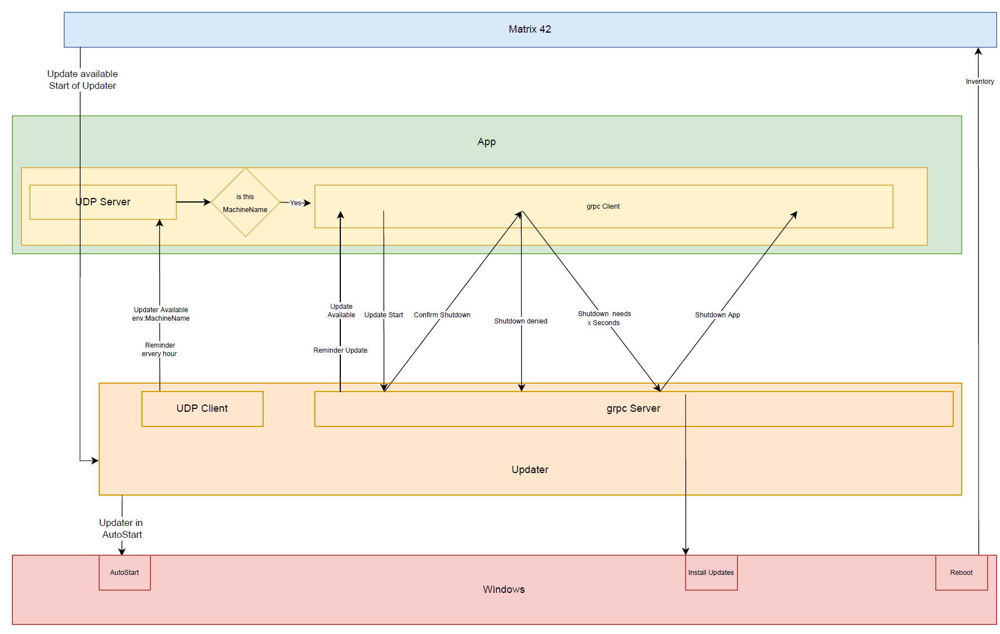

# Updater (Proof of concept)

## Overview




## Publish (create artifacts)

run this first
```console
dotnet cake
or 
BuildApps.cmd
```
in this folder to create the artifacts.


## Test

### One TestApp
```console
dotnet cake --target="TestOneTestApp"
or 
TestOneTestApp.cmd
```

### Two TestApps
```console
dotnet cake --target="TestTwoTestApps"
or 
TestTwoTestApps.cmd
```


### Three TestApps
```console
dotnet cake --target="TestThreeTestApps"
or 
TestThreeTestApps.cmd
```

### Kill running Apps
```console
dotnet cake --target="KillApps"
or 
KillApps.cmd
```
